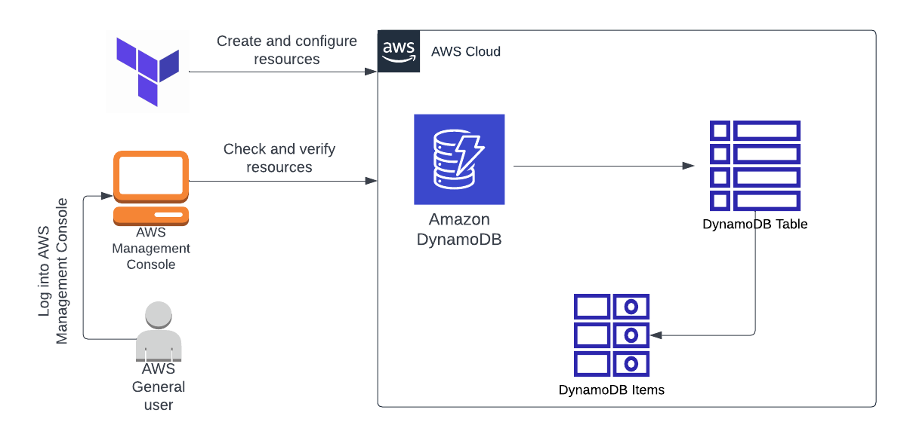

# Create-DynamoDB-Table-and-Insert-Items-to-table-using-Terraform

Architecture Diagram :

> #### Terraform commands 
>
> - terraform init 
> - terraform plan
> - terraform apply
> - terraform destroy